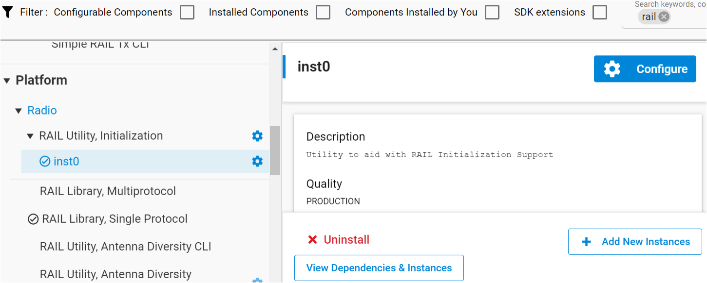

# How to integrate RAILtest into the proprietary application  

## Introduction and motivation  

Silicon Labs usually recommends customers to use RAILtest application to measure or test RF performance for the EFR32 custom boards. But it requires to flash the firmware(RAILtest and Proprietary application) twice during mass production, which brings additional cost for customers.  Additionally, RAILtest function is too heavy and require more flash space for proprietary application, especially it is impossible to run RAILtest in 128K flash chip. In the past years, we heard many customers raise the same request from time to time, they prefer to port the RAILtest function into a Proprietary application so that they can flash the firmware only once in the factory. It is the similar to MFGLIB function in Zigbee technology.
In short, customer hope a simplified and built-in RF test functionality. This project will demonstrate how to integrate partial RAILtest functionality to a proprietary application.
  
## Overview

The RF test PHY will share the common PHY with user application PHY, thus to ensure the test result is for real PHY which is real in use. Due to the BER test require a special PHY which can not be used for normal TX/RX packet. Hence, the protocol-based multi-PHY is the best solution for such scenario. Here are 2 phys are defined in this demo project as below.

- BER test PHY, channel configuration index is 0, it can only be used for BER test, and it can not be used for packet transmission and reception.
- User application PHY, channel configuration index is 1, this PHY is used for application PHY and RF test, user will develop their own application on this PHY. By default, the application PHY is applied when system startup.
  
These PHY can be switch to each other using the CLI command `rftest setConfigIndex`, the relationship between them is as the following figure.


### Note

Users should make sure the BER PHY basic configuration(modulation type, bit rate, frequency, channel) is consistent with application PHY. Otherwise, the result of BER test won’t reflect the real performance.

## Which RAILtest command will be supported

For most of RAIL-based applications, there is only need a part of RAILtest command for RF performance test and basic reception and transmission.
| No | CLI Command| Function description|
|:---:|:------------:|:-------------------|
|1|getVersion |Get version information for RAIL library|
|2|printDataRates|Print the data rates of the current PHY|
|3|setRfPath|Set the RF path|
|4|getConfigIndex|Get the index of the current multi-PHY radio config|
|5|setConfigIndex|Activate a multi-PHY radio configuration|
|6|setRxOptions| Show/Configure receive options (RAIL_RX_OPTIONs)|
|7|rx|Control receive mode|
|8|setTxOptions|Show/Configure receive options (RAIL_RX_OPTIONs).|
|9|tx|Transmit packets with current TX options.|
|10|setPower|Set the transmit power. The radio must be IDLE.|
|11|getPower|Get the transmit power in deci-dBm.|
|12|getPowerLimits|Get min and max powerLevel for a power mode.|
|13|getRssi|Get RSSI in dBm. It'll be invalid if receiver isn't ready.|
|14|setTxTone|Control tone transmission.|
|15|setTxStream| Control stream transmission.|
|16|status| Print the current status counters.|
|17|setCtune|Set the value of HFXO CTUNE. The radio must be IDLE.|
|18|getCtune|Get the value of HFXO CTUNE.|
|18|setCtuneDelta|Set the value of HFXO CTUNE delta.|
|19|getCtuneDelta|Get the value of HFXO CTUNE delta.|
|20|getChannel|Get the current radio channel.|
|21|setChannel|Set the radio channel.|
|22|setBerConfig|Set number of bytes to receive in BER mode.|
|23|berRx|Control BER receive mode.|
|24|berStatus|Get status of current or last BER test.|
|25|reset|Perform a reboot of the chip.|
|26|resetCounters|Resets the TX and RX counters.|

## Which RAILtest command are not supported

Below list are the not supported command

- BLE related command
- IEEE 802.15.4 related command
- Z-Wave related command
- CSMA/LBT, Auto ACK, Channel Hopping, Low Duty Cycle, sleep.
- Advanced mode, FIFO mode, direct mode, address filter.
- Debug command(Such as PRS, Timer)

## How to use it

### Preparing

- Two WSTK boards: 4264C board
- IDE: Simplicity Studio V5
- SDK Version: SDK V4.0.2
- Import the attached project file(.sls file) to Simplicity Studio V5, compiling and flashing to device.
- Open series console, issuing the `rftest help` command to get all RF test related command description. All the commands are compatible with RAILtest.
  
### RF test command

#### Startup

By default, current PHY is the user application PHY when startup. To switch the RF measure PHY, We have to issue the `rftestEnable` command to switch to RF test mode before RF test.

    rftestenable

#### Set and get channel

Get current channel

    rftest GetChannel
Set channel to a specific channel, for example, set channel to 1

    rftest SetChannel 1

#### Test TX power and spectrum

Output the carrier signal with 20dbm.

    rftest setPower 200
    rftest setTxTone 1
Output the modulated signal with 20dBm.

    rftest setPower 200
    rftest setTxStream 1

#### Fine tune the Ctune Value

Get the Ctune value

    rftest getCtune
Set the Ctune value

    rftest setCtune

#### Packet reception and transmission

Enable radio Rx

    rftest rx 1
Disable radio Rx

    rftest rx 0
Transmit a specific number packets, for example, send 10 packets, the default interval between packets is 20ms.

    rftest tx 10
Set the RX options, such as specific the Rx antenna.

    rftest setRxOptions
Set the TX options, such as remove CRC or use the specific preamble length to transmit packet.

    rftest setTxOptions
Set the packet length, by default the packet length is 16 bytes, but we can also set the packet length, please note that should keep the same length setting on both of transmitter and receiver. Otherwise, the reception error will occur.

    rftest setTxLength 32
Set the content of payload.

    rftest setPayload 0 2 3 4 5 6
Print all the content of payload.

    rftest printTxPacket

#### PER Test

Please find the `rftest_common.h` file in rftest folder and modify the definition of the trigger PIN and PORT based on your own hardware. In this demo project, the GPIO PA5 is used for PER test.

    rftest perRX 1000 100000
Get the RX counters and status

    rftest status

#### BER Test

Since the BER test need a special PHY, which is different with the common reception and transmission. The BER test PHY index is 0 by default, it is necessary to issue `rftest setConfigIndex` command to switch to BER test PHY.

    rftest setConfigIndex 0
Switch to dedicated BER test PHY

    rftest setBerConfig 1000 1
Configure 1000 bytes data for BER test.

    rftest BerRx 1
Start to BER test.

    rftest BerStatus
Get the BER test result

## How to port RF test in RAIL-based application

This section will describe how to port the rftest functionality to other RAIL-based application, here I would like to use the simple TRX example to demonstrate it.

- Copying the `rftest` folder to your project location.  
  Copy the whole [rftest](src/rftest/) folder in src/rftest path to your project.
- Setting the path  
  Right-click the project, properties→C/C++ build→Settings→GNU ARM C compiler→Includes, add the path of rftest folder to the includes path.
  
  

- Setting the radio configuration.  
  Open the .slcp file in project, and create the multi-PHY as the following figure.

  

- Setting the default PHY configuration index to 1, the index of 1 represent the user application PHY's index in this demo project.
  - Search `RAIL` in SOFTWARE COMPONENT tab, and click the `configure` icon in the right corner.
  
    

  - Setting the default PHY index to 1.
  
    

- Replacing the `sl_rail_util_on_event()` function in `sl_rail_util_callback.c` file.
  - Finding `sl_rail_util_callbacks.c` in `autogen` folder, include the head file `#include "rftest_common.h"`
  
    ```c  
    #include "rail.h"
    #include "sl_component_catalog.h"
    #ifdef SL_CATALOG_APP_ASSERT_PRESENT
    #include "app_assert.h"
    #include "rftest_common.h"
    ```
  - Finding the `sli_rail_util_on_event()` function and replacing the function `sl_rail_util_on_event()` with `rail_event_callback_process()`.
  
    ```c
    // Internal-only callback set up through call to RAIL_Init().
    void sli_rail_util_on_event(RAIL_Handle_t rail_handle,
                                RAIL_Events_t events)
    {
      rail_event_callback_process(rail_handle, events);
    }
    ```

- Modifying the `app_init()` function  
  Add the function `rail_event_callback_register()` and `rftest_add_cli_cmd_group()` to `app_init()` function.

  ```c  
  RAIL_Handle_t app_init(void)
  {
    validation_check();
    // Get RAIL handle, used later by the application
    RAIL_Handle_t rail_handle = sl_rail_util_get_handle(SL_RAIL_UTIL_HANDLE_INST0);

    set_up_tx_fifo(rail_handle);

    // Register the rail EVENT callback
    rail_event_callback_register(sl_rail_util_on_event);
    // The packet structure should be consistent with user application's.
    rftest_configure(rail_handle, true, RFTEST_PACKET_LENGTH);
    // Turn OFF LEDs
    sl_led_turn_off(&sl_led_led0);
  #if defined(SL_CATALOG_LED1_PRESENT)
    sl_led_turn_off(&sl_led_led1);
  #endif
    // Start reception
    RAIL_Status_t status = RAIL_StartRx(rail_handle, CHANNEL, NULL);
    if (status != RAIL_STATUS_NO_ERROR) {
      app_log_warning("After initialization RAIL_StartRx() result:%d ", status);
    }

    // CLI info message
    print_sample_app_name("Simple TRX with RF test");

    return rail_handle;
  }
  ```
- Adding rftest main loop process in main process.
  Finding `sl_event_handlder.c` function and adding the `rftest_app_main()` to `sl_internal_app_process_action()` function as the following code snippet.

  ```c
  void sl_internal_app_process_action(void)
  {
    rftest_app_main();
  }
  ```

## Resource usage compared with simple_TRX example

Below table is a comparison between original simple TRX and after add the rftest functions.
| Project | Flash usage | RAM usage |
|:-------:|:-----------:|:---------:|
|Simple TRX|89.8k|5.85k|
|RAILtest built into Simple TRX|109.6k|6.36k|
|Increased resource| 19.8k| 0.51k|

Conclusion:

As we can see the table above, the increment flash is only 19.8k, and the increment RAM is 0.51k, it is acceptable for the resource restriction SOC.

## FAQ

### Dose this project support connect stack?

Unfortunately, so far the RFtest functionality can only port to RAIL-based application, it does not support Connect stack.

### How to configure the BER PHY for BER test?

All the basic PHY configuration should be consistent with user application PHY to guarantee the RF performance is test for real using in application. Such as modulation type, frequency, data rate and deviation.
Finally, please do not forget to enable the BER test selection card.


## Reference

- [UG409 RAILtest users guide](https://www.silabs.com/documents/public/user-guides/ug409-railtest-users-guide.pdf)

- [AN972 EFR32 RF eval guide](https://www.silabs.com/documents/public/application-notes/an972-efr32-rf-eval-guide.pdf)

## Declaration

This code has not been formally tested and is provided as-is. It is not suitable for production environments. In addition, this code will not be maintained and there may be no bug maintenance planned for these resources. Silicon Labs may update projects from time to time.
